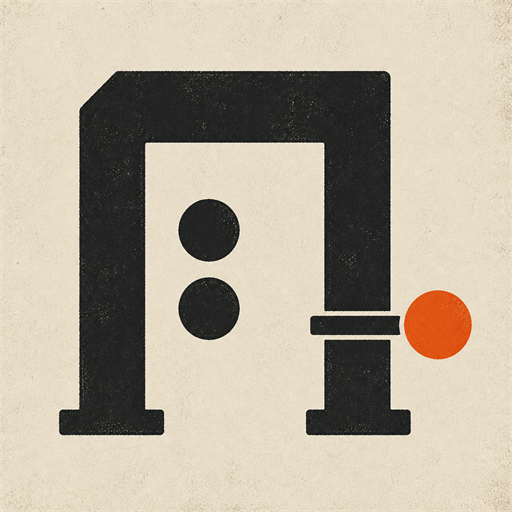

# S1 Net Guard

<p align="center">
  
</p>

Host-side protection and security research for a Schedule I multiplayer
admission flaw.

https://github.com/user-attachments/assets/5ccbcb0d-00bd-40c6-bf06-567fb1dcb196

[Security write-up](reports/schedule-i-unauthenticated-p2p-rpc-abuse.md) |
[Evidence status](EVIDENCE.md) |
[Controlled reproduction](tests/Repro/README.md) |
[Configuration](CONFIGURATION.md) |
[Incident clip](evidence/streamer-incident.mp4)

## Confirmed behavior

On Schedule I `0.4.6f11 Alternate`, a controlled client outside the host's
lobby used the direct `LoadAsClient` path and reached an authenticated, loaded
game session. The host made no game-level admission decision before FishNet
authenticated the peer.

The same controlled client reached shared-money, native world-space dialogue,
and NPC-targeting RPC paths. Two independent runs changed the isolated test
save's online balance from `0` to `-123.45` and persisted the result.

These results used distinct local GSE identities. GSE replaces Steam's API DLL
and reproduces the game-facing interfaces and callbacks, so it exercises the
unchanged Schedule I, FishySteamworks, FishNet, and game-RPC path. Its LAN lobby
policy is not Valve-equivalent, so the unrelated-account Valve test remains
deferred. The precise boundary is documented in [EVIDENCE.md](EVIDENCE.md#gse-compatibility-boundary).

## What the mod does

S1 Net Guard checks the transport SteamID before FishNet authenticates a remote
connection. By default, it admits the local host, a current-lobby Steam friend,
or a SteamID the host explicitly allowlisted. It rejects direct non-members,
untrusted lobby members, invalid identities, and unverifiable lobby state.

Optional defense-in-depth patches block the reviewed money, free-text dialogue,
and NPC-targeting RPCs. They are disabled by default because the base game does
not expose enough role information to preserve every legitimate multiplayer
action automatically.

Controlled negative tests confirmed both layers:

- The admission gate rejected a direct non-member before FishNet
  authentication.
- An explicitly allowlisted peer connected, but the RPC guards blocked all
  three requests and kept the runtime and saved balance at `0`.

## Install

Copy `local.build.props.example` to `local.build.props`, set the local game
paths, and build the matching runtime:

```powershell
dotnet build S1NetGuard.csproj -c Mono -p:AutomateLocalDeployment=false
dotnet build S1NetGuard.csproj -c Il2cpp -p:AutomateLocalDeployment=false
```

Copy the matching output into the game's `Mods` directory:

```text
bin/Mono/netstandard2.1/S1NetGuard_Mono.dll
bin/Il2cpp/net6.0/S1NetGuard_Il2Cpp.dll
```

The admission gate is enabled with fail-closed defaults. Hosts who invite a
non-friend must add that SteamID64 to `AllowedSteamIds` or explicitly enable
the broader lobby-member compatibility mode. See [CONFIGURATION.md](CONFIGURATION.md).

## Recommended game fix

The game should attach a session-aware FishNet `Authenticator` before starting
the server. That authenticator must approve the transport-verified SteamID
before FishNet reaches `ClientAuthenticated`. High-risk RPCs must separately
validate the sender's session role and authority over the requested action.

The [security write-up](reports/schedule-i-unauthenticated-p2p-rpc-abuse.md#remediation)
contains the proposed control flow and regression matrix.

## Validation status

- GSE direct-admission reproduction: passed on Mono `0.4.6f11 Alternate`.
- GSE money, dialogue, NPC-control, and save-impact reproduction: passed twice.
- GSE admission and RPC-defense controls: passed.
- Mono and IL2CPP builds, startup checks, and reviewed game surfaces: passed.
- Admission-policy verifier: 12 scenarios passed.
- Live Valve FriendsOnly, direct-client, and impact matrix: deferred until two
  unrelated Steam accounts can run concurrently.

Run the public controlled harness from [tests/Repro](tests/Repro/README.md).
Raw logs, real SteamIDs, lobby IDs, emulator files, copied game installs, test
saves, proprietary assemblies, and generated IL2CPP wrappers remain outside
Git.
